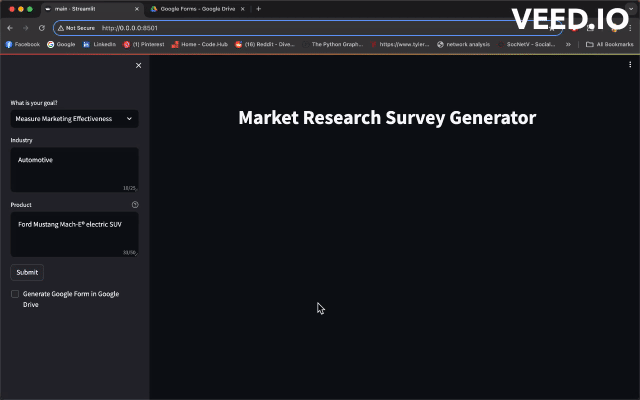

# Market Research Survey Generator

The Market Research Survey Generator is a Python application that leverages Langchain, HuggingFace transformers and OpenAI to create market research survey statements based on user input. It provides users with the ability to generate a survey containing 10 statements/questions tailored to their specific market research needs. Additionally, the application allows users to automatically create a corresponding Google Form in their Google Drive. See list of [supported languages](https://huggingface.co/SnypzZz/Llama2-13b-Language-translate#languages-covered). 

 - [gpt-3-5-turbo](https://platform.openai.com/docs/models/gpt-3-5-turbo): model used for survey content generation
 - [SnypzZz/Llama2-13b-Language-translate](https://huggingface.co/SnypzZz/Llama2-13b-Language-translate): model used for survey translation

## Features

- **Dynamic Survey Generation**: Generate market research survey statements based on user needs.
- **Support for 40+ languages**: Make surveys accessible to wider audiences.
- **Google Form Integration**: Create a Google Form in Google Drive with the generated survey statements.
- **Streamlit User Interface**: Hosted on localhost, the application features a basic user interface powered by Streamlit.

## Requirements
Currently the application is not hosted on a public server, however you can rebuild it on your local machine. 
To rebuild and run the application on localhost, ensure you have the following:

- [Docker](https://www.docker.com/products/docker-desktop/)
- [Active OpenAI key](https://platform.openai.com/api-keys)
- [Google Cloud OAuth 2.0 credentials (credentials.json)](https://support.google.com/cloud/answer/6158849?hl=en) with *Google Forms API* and *Google Drive API* APIs enabled ([how to guide](https://cloud.google.com/endpoints/docs/openapi/enable-api#console))

## Rebuild Instructions

1. Clone the repository to your local machine: `git clone https://github.com/yourusername/market-research-survey-generator.git`
2. Navigate to the project directory: `cd market-research-survey-generator`
3. Create `.env` file specifying `OPENAI_API_KEY` and `DRIVE_FOLDER_ID` parameters
4. Place `credentials.json` inside the folder
5. Build the Docker image: `docker build -t market-research-survey .`
4. Run the Docker container:  `docker run -t -p 8501:8501 market-research-survey` (*-t* shows docker logs)
5. Access the application in your web browser at http://localhost:8501
6. Done :tada:

